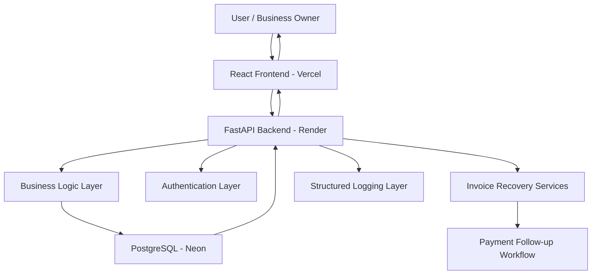

# Technical Architecture

## Architecture Summary
PayGuard AI uses a three-tier architecture: React frontend on Vercel, FastAPI backend on Neon, and PostgreSQL database on Neon.



## Frontend Layer
- **Framework**: React 19 with React Router
- **Styling**: Tailwind CSS with shadcn/ui components
- **Charts**: Recharts
- **Deployment**: Vercel (free tier)
- **Build**: CRACO (Create React App Configuration Override)
- **Responsive**: Mobile-first design with Tailwind breakpoints (`sm:640px`, `md:768px`, `lg:1024px`, `xl:1280px`)
  - Mobile navigation via Sheet drawer
  - Card views for data tables on mobile
  - Responsive grids and typography

## Backend API Layer
- **Framework**: FastAPI
- **Deployment**: Render (free tier)
- **Entry point**: `backend/server.py`
- **Routes**: REST API under `/api` prefix
- **Modules**:
  - `server.py` — FastAPI app, all 25+ routes, startup/shutdown
  - `db.py` — SQLAlchemy async engine, ORM models, session management
  - `auth_utils.py` — JWT + bcrypt helpers
  - `ai_service.py` — AI invoice parsing, follow-up generation, risk scoring, report generation
  - `seed.py` — Demo data seeder
  - `logging_config.py` — Structured JSON logging setup
  - `middleware.py` — Request logging middleware

## Database Layer
- **Engine**: PostgreSQL via Neon serverless
- **ORM**: SQLAlchemy async with `asyncpg` driver
- **Tables**: users, settings, customers, invoices, payments, followups
- **Auto-creation**: Tables created on startup via `Base.metadata.create_all`
- **SSL**: Handled via `connect_args` (asyncpg doesn't support `sslmode` query parameter)

## Authentication Layer
- **Method**: Email/password login with JWT bearer tokens
- **Password hashing**: bcrypt with generated salts
- **Token validation**: FastAPI HTTP bearer auth middleware
- **Token storage**: Client-side sessionStorage

## Structured Logging Layer
- **Format**: JSON structured logs via `logging_config.py`
- **Files**:
  - `app.log` — All application events (rotating, 5MB max, 5 backups)
  - `error.log` — Errors only
  - `access.log` — HTTP request/response logs
- **Configuration**: `LOG_LEVEL` (default: INFO) and `LOG_DIR` env vars
- **Sensitive data filtering**: Passwords, tokens, and secrets are masked in logs
- **Middleware**: RequestLoggingMiddleware captures method, path, status code, duration

## Business Logic Layer
- Invoice status calculation (Due Soon, Due Today, Overdue, Paid, etc.)
- Overdue-day calculation
- Payment amount application to invoice balances
- Customer risk scoring from overdue invoices, follow-up behavior, broken promises, and credit limits
- Invoice follow-up timeline generation
- Cashflow forecast based on invoice due dates and risk category
- AI-generated follow-up messages, risk summaries, and recovery reports

## Deployment Architecture

```
┌─────────────────────────────────────────────────────────┐
│                    Vercel (Frontend)                      │
│         React SPA — Static files, SPA routing            │
│         REACT_APP_BACKEND_URL → Render backend           │
└──────────────────────────┬──────────────────────────────┘
                           │ HTTPS
                           ▼
┌─────────────────────────────────────────────────────────┐
│                    Render (Backend)                       │
│         FastAPI — uvicorn, free tier                     │
│         DATABASE_URL → Neon PostgreSQL                   │
│         Logs to /tmp/logs (ephemeral)                    │
└──────────────────────────┬──────────────────────────────┘
                           │ SSL
                           ▼
┌─────────────────────────────────────────────────────────┐
│                   Neon (Database)                         │
│         PostgreSQL serverless — free tier                │
│         Connection pooling, auto-scaling                 │
└─────────────────────────────────────────────────────────┘
```

## Data Flow
1. User opens Vercel-hosted frontend
2. Frontend sends authenticated API requests to Render-hosted backend
3. Backend validates JWT tokens, runs business logic
4. Backend reads/writes Neon PostgreSQL via SQLAlchemy async
5. Backend returns JSON responses
6. Frontend updates page state, charts, and tables from responses
7. Structured JSON logs written to `logs/` directory
