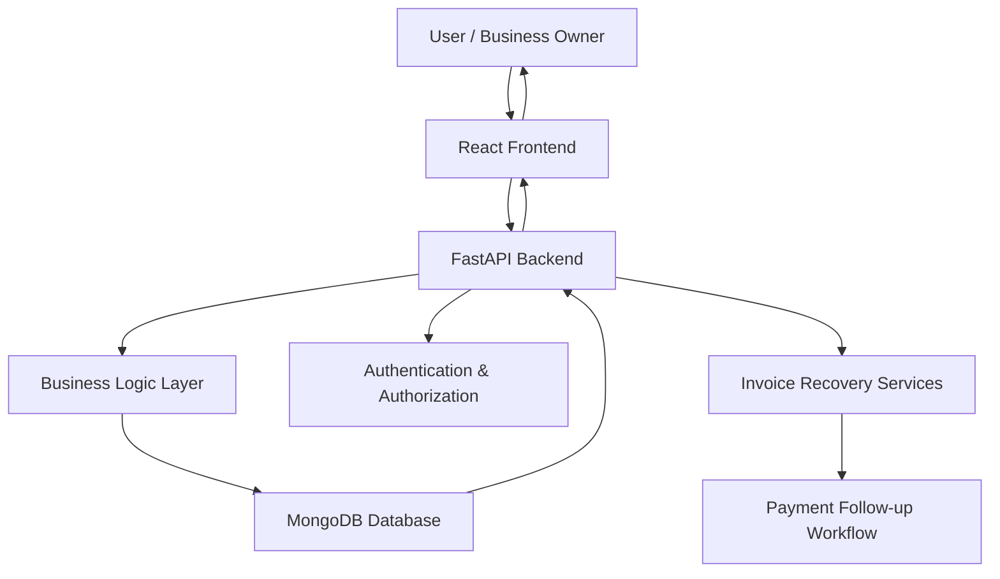

# Technical Architecture

## Architecture Summary
The current repository uses a React frontend, FastAPI backend, MongoDB database, and JWT authentication. The hosted product is available at https://invoice-recovery-5.emergent.host/.

## Frontend Layer
The frontend is built with React, React Router, Tailwind CSS, lucide-react icons, and Recharts. It provides protected pages for dashboard, customers, invoices, payments, AI follow-ups, cashflow, reports, settings, profile, and how-to-use.

## Backend API Layer
FastAPI exposes REST endpoints under `/api`. It handles authentication, customer CRUD, invoice CRUD, payments, follow-ups, AI services, dashboard summaries, charts, cashflow forecast, settings, and health checks.

## Database Layer
The code uses MongoDB through Motor async driver. Collections include `users`, `settings`, `customers`, `invoices`, `payments`, and `followups`.

## Authentication Layer
Authentication uses email/password login, bcrypt password hashing, JWT tokens, and FastAPI HTTP bearer token validation.

## Business Logic Layer
Business logic includes invoice status calculation, overdue-day calculation, customer risk scoring, payment balance updates, follow-up tracking, timeline generation, cashflow forecast, and AI report generation.

## Invoice/Payment Recovery Workflow
Customers are created first, invoices are attached to customers, payment activity updates invoice balances, follow-ups record recovery action, and dashboard/cashflow views summarize business health.

## Deployment Environment
The app is already hosted. Local deployment requires backend environment variables for MongoDB, JWT, CORS, and any AI provider credentials, plus frontend `REACT_APP_BACKEND_URL`.

## Data Flow
The frontend sends authenticated API requests to FastAPI. FastAPI validates JWT tokens, runs business logic, reads/writes MongoDB collections, and returns JSON responses. The frontend updates page state and charts from those responses.
