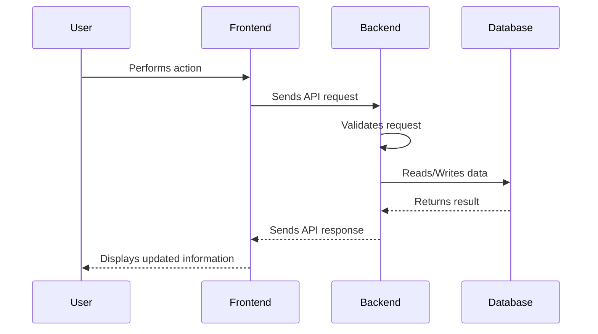

# Backend API Flow Diagram

## Explanation
Every protected action sends a JWT-authenticated request. The backend validates the token, validates input, runs business logic, performs database operations, and returns a response.

## Business Meaning
Users see current payment and recovery data after every operation.

## Technical Meaning
This is the standard request-response lifecycle for the REST API.
