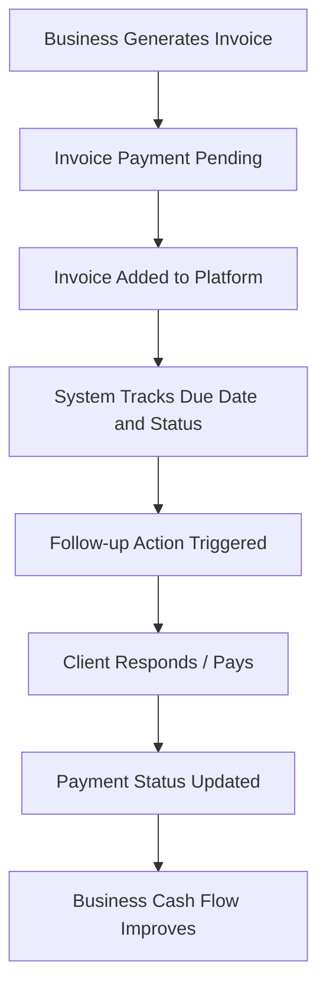

# Business Flow Diagram

## Explanation
Invoices move from creation to tracking, follow-up, customer response, payment update, and improved cashflow visibility.

## Business Meaning
The business can prioritize unpaid bills and reduce missed recovery actions.

## Technical Meaning
The flow is supported by customer, invoice, follow-up, payment, dashboard, and cashflow APIs.
