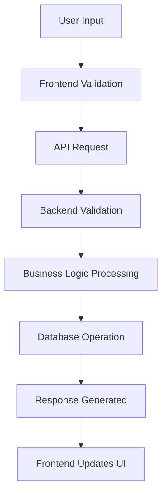

# Data Flow Diagram

## Explanation
Users enter data such as customer details, invoice details, payment records, follow-up notes, settings, or AI requests. The frontend performs basic checks and sends the data to FastAPI. The backend validates request bodies with Pydantic, applies business logic, writes or reads MongoDB, and returns JSON.

## Business Meaning
The business gets updated receivables information quickly after each action.

## Technical Meaning
Validation occurs on both client and server, with server-side validation being authoritative.
