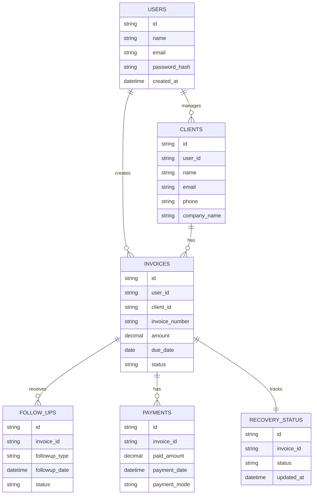

# Database ER Diagram

## Current Implementation Note
The current code uses MongoDB collections. The following Mermaid ER diagram represents a recommended relational model if the project later migrates to PostgreSQL.

## Business Meaning
This model keeps business owners, clients, invoices, payments, follow-ups, and recovery status connected.

## Technical Meaning
In MongoDB, these relationships are stored with IDs such as `user_id`, `customer_id`, and `invoice_id`. In PostgreSQL, foreign keys would enforce these relationships.
