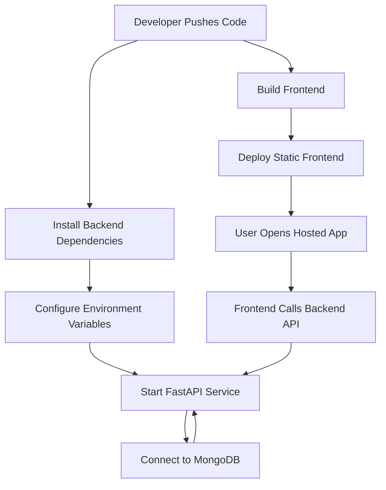

# Deployment Flow Diagram

## Explanation
The frontend is built and deployed as a web app. The backend runs FastAPI with required environment variables. MongoDB stores application data. The browser calls the backend API from the deployed frontend.

## Business Meaning
Users access one hosted product while the platform handles UI, API, and database responsibilities behind the scenes.

## Technical Meaning
Deployment requires correct frontend backend URL, backend secrets, database connection, CORS settings, and health checks.
