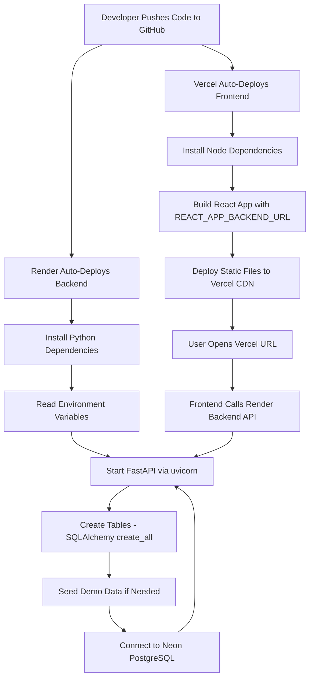

# Deployment Flow Diagram

## Explanation
The developer pushes code to GitHub. Render detects the push and auto-deploys the backend: it installs Python dependencies, reads environment variables (DATABASE_URL, JWT_SECRET, etc.), starts FastAPI via uvicorn, automatically creates database tables, and seeds demo data on first run. It connects to Neon PostgreSQL for data storage.

Vercel simultaneously auto-deploys the frontend: it installs Node dependencies, builds the React app with the production `REACT_APP_BACKEND_URL`, and deploys static files to Vercel's CDN.

Users access the Vercel-hosted frontend, which makes API calls to the Render-hosted backend, which reads/writes data from Neon PostgreSQL.

## Business Meaning
Users access one hosted product while the platform handles UI, API, and database responsibilities across three free-tier services.

## Technical Meaning
- **Vercel**: Static SPA hosting with SPA routing rewrites
- **Render**: Python web service with `render.yaml` blueprint
- **Neon**: Serverless PostgreSQL with connection pooling and auto-scaling
- **SSL**: Enforced between all tiers (Render ↔ Neon via `connect_args`)
- **Logging**: Structured JSON logs written to Render's ephemeral `/tmp` directory
