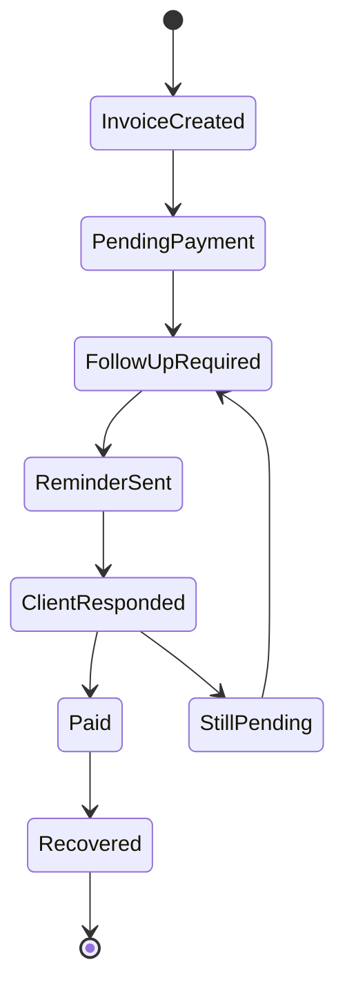

# Invoice Recovery Flow Diagram

## State Explanation
- InvoiceCreated: Invoice has been added.
- PendingPayment: Invoice has an unpaid amount.
- FollowUpRequired: Invoice is due soon, due today, overdue, or manually selected for recovery.
- ReminderSent: A follow-up message was generated or sent outside the system and recorded.
- ClientResponded: Customer response or promise is recorded.
- StillPending: Payment has not yet been received.
- Paid: Invoice balance is cleared.
- Recovered: Recovery workflow is complete.

## Business Meaning
The business can see where each invoice sits in the recovery cycle.

## Technical Meaning
Current invoice status is stored on invoice documents, while follow-up activity is stored separately in follow-up documents.
