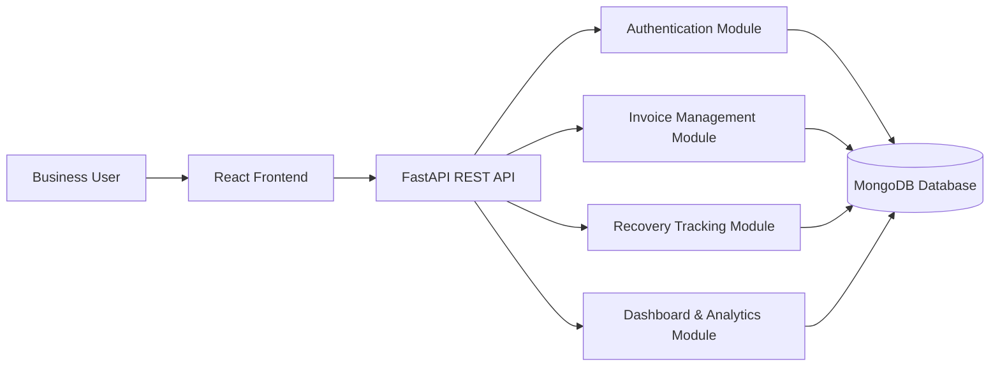

# System Architecture Diagram

## Explanation
The user works through the React frontend. The frontend sends REST requests to the FastAPI backend. Backend modules handle authentication, invoices, recovery tracking, dashboard data, and persistence in MongoDB.

## Business Meaning
The business gets one centralized place to manage customers, invoices, payments, follow-ups, risk, reports, and cashflow.

## Technical Meaning
The architecture separates UI, API, authentication, business logic, and database responsibilities.
