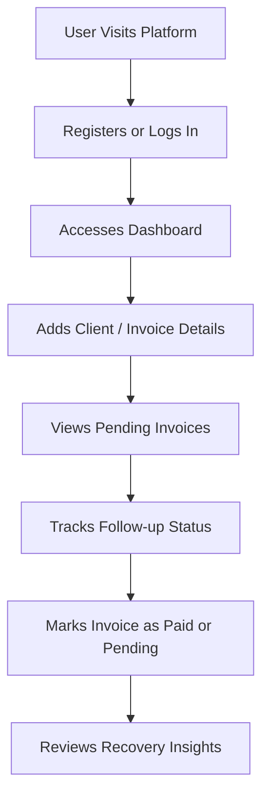

# User Flow Diagram

## Explanation
The user starts with authentication, then manages customers and invoices, monitors pending amounts, records follow-up actions, updates payment status, and reviews dashboard insights.

## Business Meaning
This journey turns payment recovery from a scattered manual task into a repeatable workflow.

## Technical Meaning
Each step maps to protected frontend routes and FastAPI endpoints for customers, invoices, payments, follow-ups, dashboard, and reports.
